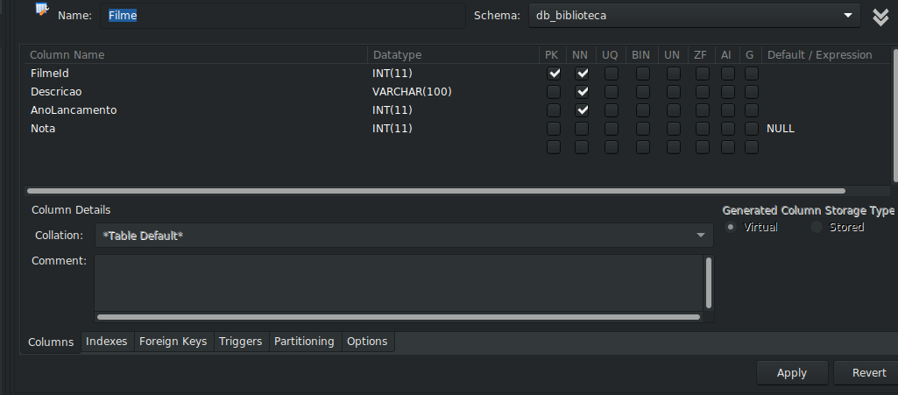

<h1>Exercicios dia 19.1 Introdução à SQL</h1>

<h2> Exercício 1: Descubra como fazer uma pesquisa em qualquer tabela sem utilizar uma linha de código usando o MySql Workbench. </h2>

<h4>Resposta:</h4> 
  Na aba Schemas é possivel selecionar o banco de dados e posteriormente visualizamos as tabelas,
clicando com o botão direito sobre uma das delas, abre um menu com a opção "Select Rows - Limit 1000", sendo assim possivel fazer varios tipos de pesquisas.

<h2> Exercício 2: Descubra como é possível criar uma tabela sem usar código SQL usando o MySql Workbench. </h2>

<h4>Resposta:</h4> 
  No menu superior, temos a opção "Create a new table in the active schema in connected server", selecionando esta opção abrirá uma janela com os campos de nome da table , nome da coluna , datatype, e ainda temos opcçao de checked se a coluna será PK(primary key), NN (no null), e etc ...

<h2> Exercício 3: Feito isso, crie uma tabela com as seguintes restrições:
Nome da tabela: 
Filme

Colunas:
FilmeId - primary key, tipo int, incrementa por 1 cada vez que um valor é inserido automaticamente;
Descricao - não permite nulos, tipo texto (varchar(100));
AnoLancamento - não permite nulos, tipo int;
Nota - permite nulos, tipo int; </h2>

<h4>Resposta:</h4> 

<h2> Exercício 4: Analise a tabela city e encontre a tabela à qual a coluna country_id faz referência. </h2>

<h4>Resposta:</h4> 
 Pela coluna country_id é possivel identificar os paises da tabela country

<h2> Exercício 5: Após resolver o exercício anterior, responda: qual tipo de relacionamento a tabela city faz com a tabela country ? </h2>

<h4>Resposta:</h4> 
 Relacionamento N:1, pois varias cidades fazem parte do mesmo pais.

<h2> Exercício 6: Qual tipo de relacionamento a tabela country faz com a tabela city ?</h2>

<h4>Resposta:</h4> 
 Relacionamento 1:N, pois um pais e obtem varias cidades

<h2> Exercício 7: Abra tabela por tabela do banco sakila e encontre no mínimo 3 exemplos de um relacionamentos 1:N ou N:1. </h2>

<h4>Resposta:</h4> <ul> 
<li>Tabela Address para City, relacionamento N:1, pois varios endereços podem fazer parte da mesma cidade</li>
<li>Tabela city para Address, relacionamento 1:N, pois apenas uma cidade podem receber varis enredereços especificos </li>
<li>Tabela film_actor para film, relacionamento N:1, varios atores podem participar do mesmo filme</li>
</ul>
