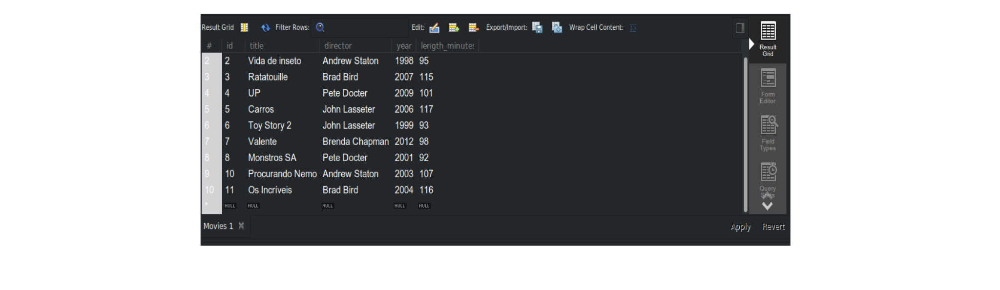
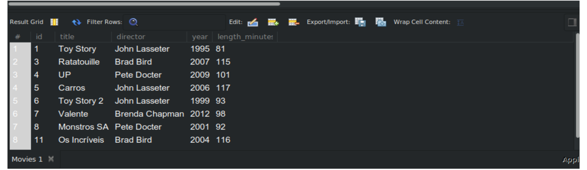

# Exercicio 19.4

**Exercicios 1:** Insira as produções da Pixar abaixo na tabela Movies :

  * Monstros SA, de Pete Docter, lançado em 2001, com 92 minutos de duração.

  * Procurando Nemo, de John Lasseter, lançado em 2003, com 107 minutos de duração.

  * Os Incríveis, de Brad Bird, lançado em 2004, com 116 minutos de duração.

  * WALL-E, de Pete Docter, lançada em 2008, com 104 minutos de duração.

  **Resposta:**

  ;

  **Exercício 2:** Procurando Nemo foi aclamado pela crítica! Foi classificado em 6.8, fez 450 milhões no mercado interno e 370 milhões no mercado internacional. Adicione as informações à tabela BoxOffice .

  **Resposta:** 
  
  ;  
  ;

  **Exercício 3:** O diretor do filme "Procurando Nemo" está incorreto, na verdade ele foi dirigido por Andrew Staton. Corrija esse dado utilizando o UPDATE .

  **Resposta:**

  ;
  ;

  **Exercício 4:** O título do filme "Ratatouille" esta escrito de forma incorreta na tabela Movies , além disso, o filme foi lançado em 2007 e não em 2010. Corrija esses dados utilizando o UPDATE .

  **Repostas:**

  ;
  ;

  **Exercício 5:** Insira as novas classificações abaixo na tabela BoxOffice , lembre-se que a coluna movie_id é uma foreign key referente a coluna id da tabela Movies :

    * Monsters SA, classificado em 8.5, lucrou 300 milhões no mercado interno e 250 milhões no mercado internacional.

    * Os Incríveis, classificado em 7.4, lucrou 460 milhões no mercado interno e 510 milhões no mercado internacional.

    * WALL-E, classificado em 9.9, lucrou 290 milhões no mercado interno e 280 milhões no mercado internacional.

  **Resposta:**

  ;
  ;

  **Exercício 6:** Exclua da tabela Movies o filme "WALL-E".

  **Resposta:**

  ;
  ;

**Exercício 7:** Exclua da tabela Movies todos os filmes dirigidos por "Andrew Staton".

**Resposta:**

;
;